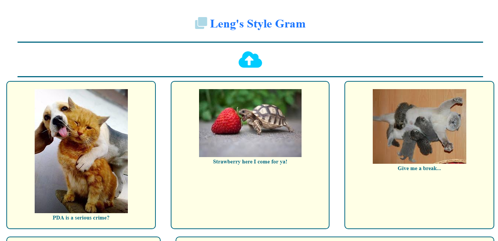
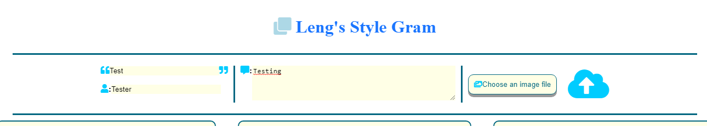
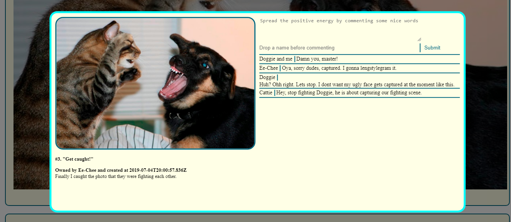
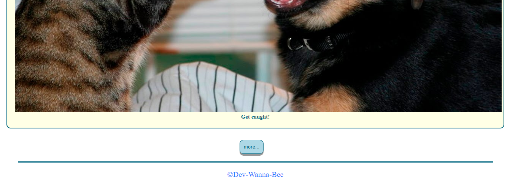

# Image Board
Image Board is an Instagram-like project that anybody could go and post an image of their choosing, along with a title and a textual description of that image, and others could go and look at that image and make thoughtful remarks about it. Check it out, there are many funny photos and comments made: https://lengstylegram.herokuapp.com/.

## Features
1) Displaying images
* A Vue instance is created and when it mounts, it makes an axios request to get the data for the images. As the data obtained, HTML template will loop through them and render each one.

2) Animated upload-cloud
* Upon clicking the blue cloud, the input fields sliding in from the left and the upload-cloud button sliding in from right.

3) Collecting data
* Four fields are required: image title, image description, username, and a file input for the image itself. A submit button is also provided. The upload-cloud button becomes clickable when all fields are filled and photo is uploaded. 
* For the three text fields, v-model directive is used to automatically collect the values that the user enters. For the file input, the "change" event is used to get the file.

4) Submitting data and auto re-rendering
* When the user clicks the submit button, a POST request containing all of the data is made. If the image upload is successful, the server responds with a payload containing the url of the image. When the client receives this response, it updates the list of images it already has to include the image that was just uploaded. This causes automatic re-rendering of the list of images with the newest image now appearing.

5) Comments
* When users click on one of the images displayed as a card on the main page, a modal(comment-section window) is popped out, displaying the title of the image, the description of the image, and the name of the user who uploaded it. 
* Besides that, it shows all of the comments that have been made about the image. There is also a form field which the user can enter his name and add a comment. When a user submits a comment, that comment appears in the list of comments without reloading the page.
* The modal is implemented as a Vue component. When the modal component mounts, axios request is made to get any data for the image it does not already have as well as all of the comments for the image. To be able to get this data, the id of the clicked image is passed to the component as a prop.
* To close the modal, user can click outside of it. The component won't be able to change the property of its parent that made it appear. It will have to emit an event that the Vue instance listens for so that it can know when to hide the modal.

6) More button
* When a user visits the site at the beginning, an axios request is made to acquire the uploaded images. However, only 5 latest uploaded images are displayed. One can click on 'more' button to request more images and only 4 additional images are displayed at a time.

7) Client-side routing
* The basic idea is to have client-side Javascript reads and interprets the url of the page and alter the page in accordance with it. With this solution, it allows users to share links that go directly to a particular image to check out all the comments about the image.
* It is convenient to use hashes (url fragments) for this. The hash is readable in the browser by means of the location.hash property and it is possible to know when the hash changes by listening for the hashchange event on the window object. Although hash changes do not cause requests to be made to the server, they do generate entries in the browser history, which means that the back button works with hashes. 
* For example, click this link: https://lengstylegram.herokuapp.com/#8. 8 is the ID number of the image. Changing the ID number will navigate you to the other images. The ID number of the particular image is shown beside the title of the image on its modal(comment-section window).

**_NOTES_**:
* Coding technologies: HTML, CSS, Javascript, Vue.js, Axios, DOM, Node.js, Express, Multer middleware, Postgresql, csurf and JSON.
* Third party tools: Amazon Web Services(S3 storage) and Fontawesome-Icons.

Thank you for reading. 9 out of 10 likes to this project.
